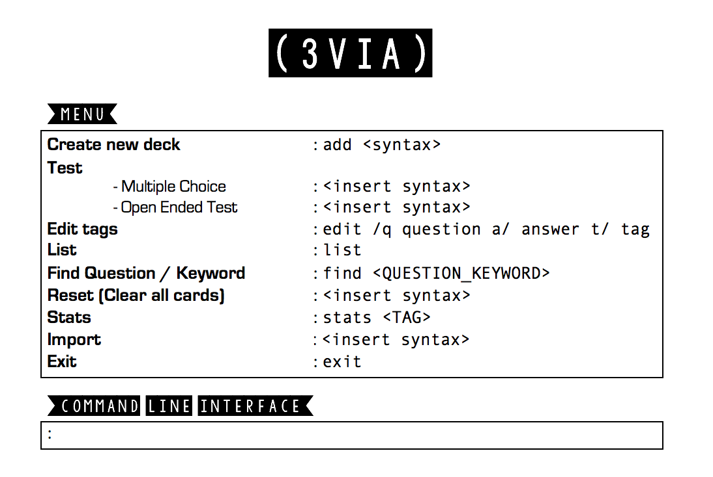

= 3VIA
ifdef::env-github,env-browser[:relfileprefix: docs/]

https://travis-ci.org/CS2103-AY1819S1-W12-3/main[image:https://travis-ci.com/CS2103-AY1819S1-W12-3/main.svg?branch=master[Build Status]]
https://ci.appveyor.com/project/damithc/addressbook-level4[image:https://ci.appveyor.com/api/projects/status/3boko2x2vr5cc3w2?svg=true[Build status]]
https://coveralls.io/github/CS2103-AY1819S1-W12-3/main?branch=master[image:https://coveralls.io/repos/github/CS2103-AY1819S1-W12-3/main/badge.svg?branch=master[Coverage Status]]
https://gitter.im/se-edu/Lobby[image:https://badges.gitter.im/se-edu/Lobby.svg[Gitter chat]]

ifdef::env-github[]

endif::[]

ifndef::env-github[]

endif::[]

* This is a desktop Trivia application. It has a GUI, better utilised using the CLI (Command Line Interface).
* App design: For _students_ to create their deck of flashcards, to modify and test their knowledge, in preparation for finals.
* Support for _Build Automation_ using Gradle and for _Continuous Integration_ using Travis CI.

== Site Map

* <<UserGuide#, User Guide>>
* <<DeveloperGuide#, Developer Guide>>
* <<AboutUs#, About Us>>
* <<ContactUs#, Contact Us>>

== Acknowledgements

* Some parts of this sample application were inspired by the excellent http://code.makery.ch/library/javafx-8-tutorial/[Java FX tutorial] by
_Marco Jakob_.
* This application was adapted from https://github.com/se-edu/addressbook-level4[AddressBookLevel 4] created by https://github.com/se-edu/[SE-EDU]
* Inspired by https://quizlet.com/[Quizlet]
* Libraries used: https://github.com/TestFX/TestFX[TextFX], https://bitbucket.org/controlsfx/controlsfx/[ControlsFX], https://github.com/FasterXML/jackson[Jackson], https://github.com/google/guava[Guava], https://github.com/junit-team/junit5[JUnit5]

== Licence : link:LICENSE[MIT]
